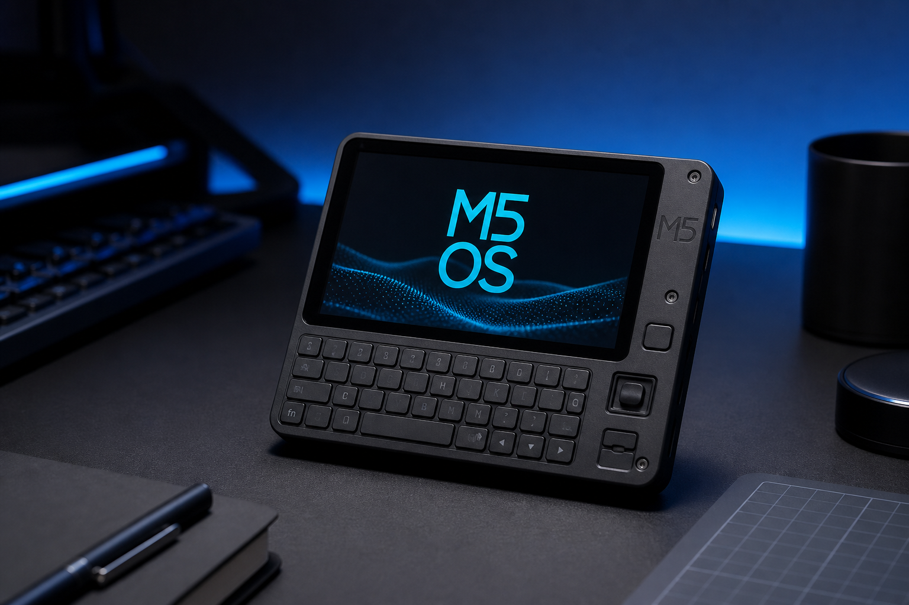
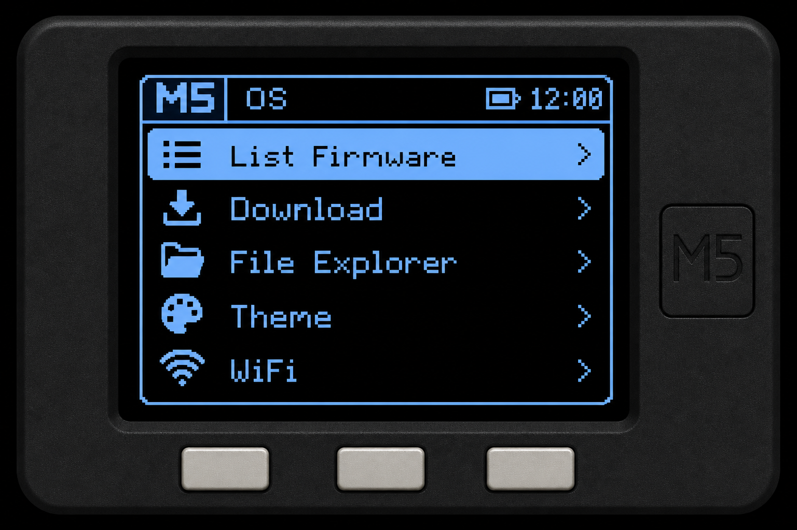

<p align="center">
  
</p>

<h1 align="center">M5 OS — Cardputer Edition</h1>

<p align="center">
  <strong>A keyboard-first firmware launcher & SD package manager for the M5Stack Cardputer</strong>
</p>

<p align="center">
  <a href="https://github.com/salvador-Data/M5_OS-Cardputer/actions/workflows/build.yml">
    
  </a>
  <a href="LICENSE"></a>
  <a href="https://docs.m5stack.com/en/core/Cardputer"></a>
  
</p>

---

## About

**M5 OS** turns your Cardputer into a small **handheld OS shell**: list firmware on microSD, download new packages from a manifest, browse files, switch themes, and join Wi-Fi — all from a clean menu tuned for the built-in keyboard.

Built by **[salvador-Data](https://github.com/salvador-Data)** / **Hacker Planet LLC** for makers, students, and authorized security researchers who live in the M5 + ESP32 ecosystem.

Part of the **Hacker Planet** toolkit → [project ecosystem](https://github.com/salvador-Data/cyberThreatGotchi/blob/main/docs/ECOSYSTEM.md).


Poll **CyberThreatGotchi** mood from the field:

| Client | Path |
|--------|------|
| MicroPython | [ctg_status.py](https://github.com/salvador-Data/cyberThreatGotchi/blob/main/scripts/cardputer/ctg_status.py) |
| PlatformIO firmware | [scripts/cardputer/platformio](https://github.com/salvador-Data/cyberThreatGotchi/tree/main/scripts/cardputer/platformio) |

```ini
# platformio.ini — set CTG_HOST to your BPI-R3 Mini IP
-DCTG_HOST=\"192.168.1.50\"
```

Full guide: [CARDPUTER.md](https://github.com/salvador-Data/cyberThreatGotchi/blob/main/docs/CARDPUTER.md).

<p align="center">
  
</p>

| Feature | Description |
|--------|-------------|
| **Installed apps** | Lists `.bin` files in `/firmware/` on SD |
| **Catalog download** | Pulls entries from a JSON manifest over Wi-Fi |
| **File explorer** | Walk SD paths from the device |
| **Themes** | Baby Blue (default), Hacker Green, Mr. Robot Red |
| **Wi-Fi setup** | Scan and connect before downloading |

Longer background → **[docs/ABOUT.md](docs/ABOUT.md)**

---

## Hardware

- [M5Stack Cardputer](https://shop.m5stack.com/products/m5stack-cardputer-kit-w-m5stamps) (ESP32-S3, keyboard, 1.14" LCD)
- microSD card (FAT32), optional USB-C for flash/power
- Wi-Fi access point you are allowed to use

---

## Flash (quick)

### PlatformIO (recommended)

```bash
git clone https://github.com/salvador-Data/M5_OS-Cardputer.git
cd M5_OS-Cardputer
pip install platformio
pio run -e m5stack-cardputer -t upload
```

### M5Burner

1. Build with PlatformIO, then flash the generated `.bin` from `.pio/build/m5stack-cardputer/`
2. Or use [M5Burner](https://docs.m5stack.com/en/uiflow/m5burner/intro) with the Cardputer target once I publish a release asset

---

## Controls

| Key | Action |
|-----|--------|
| `;` / `W` | Move up |
| `.` / `S` | Move down |
| `Enter` / `Space` | Select |
| `` ` `` | Back |

---

## Firmware catalog

Copy [`data/manifest.example.json`](data/manifest.example.json) to your own host (or GitHub raw URL) and point `kManifestUrl` in `src/M5_OS_Cardputer.ino` to it. Each entry needs `name`, `version`, `url`, and optional `description` / `size`.

Drop offline `.bin` files on SD:

```text
/firmware/my_tool.bin
```

---

## Project layout

```text
M5_OS-Cardputer/
├── src/                 # Cardputer firmware (maintained)
├── include/             # Device helpers (keyboard, display)
├── archive/             # Legacy M5Stack sketch
├── data/                # Example manifest + firmware folder
├── docs/images/         # README artwork
├── platformio.ini
└── docs/ABOUT.md
```

---

## Legal

For **education and authorized testing** on devices and networks you own. You are responsible for compliance with local law and venue policies.

---

## Related projects

- [Mr.-CrackBot-AI-Nano](https://github.com/salvador-Data/Mr.-CrackBot-AI-Nano) — Jetson Nano lab automation
- [M5-Cardputer-Mr.-Robot-Handshake-Keeper](https://github.com/salvador-Data/M5-Cardputer-Mr.-Robot-Handshake-Keeper) — Cardputer security research sketch

---

<p align="center">
  <sub>★ If this helps your build, star the repo — it fuels the next Cardputer release.</sub>
</p>
